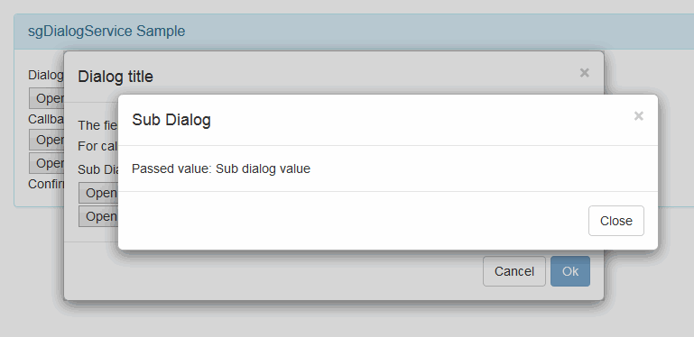

## Introduction

The library is into the lib directory.

The sample can be run on Firefox or running the following commands from this directory

* If you have Python 2.x: python -m SimpleHTTPServer 8000
* If you have Python 3.x: python -m http.server 8000
* If you have Perl:
	* cpan HTTP::Server::Brick   # install dependency
	* perl -MHTTP::Server::Brick -e '$s=HTTP::Server::Brick->new(port=>8000); $s->mount("/"=>{path=>"."}); $s->start'
* If you are under windows: "C:\Program Files (x86)\IIS Express\iisexpress.exe" /path:%CD% /port:8000
	
## sgDialogService

Needing a -simple- dialog system for Angular-JS supporting modals, dynamic templates, dragging, 
and a consisten skin for ALL the dialogs i wrote this small module.

The library is able to open nested modal dialogs, alerts and confirm.

### Notes

The sample can be run with Firefox, in general or by running, into the directory,

* If you have Python 2.x: python -m SimpleHTTPServer 8000
* If you have Python 3.x: python -m http.server 8000
* If you have Perl:
	* cpan HTTP::Server::Brick   # install dependency
	* perl -MHTTP::Server::Brick -e '$s=HTTP::Server::Brick->new(port=>8000); $s->mount("/"=>{path=>"."}); $s->start'
* If you are under windows: "C:\Program Files (x86)\IIS Express\iisexpress.exe" /path:%CD% /port:8000

### Installation 

* Copy somwehere all the files and include in your main page (e.g. in "app/sgDialogService" directory)
	* sgDialogService.css
	* sgDialogService.js
	* sgDialogTemplate.html (this can be changed)
* Add the dependency on sgDialogService module

<pre>
var myApp = angular.module('myApp',['sgDialogService']);
</pre>
	
* Add the constant to your app to intialize the dialog template

<pre>
myApp.run(["sgDialogService.config",function(sgDialogServiceConfig){
	sgDialogServiceConfig.dialogTemplate = "app/sgDialogService/sgDialogTemplate.html";
}]);
</pre>	

To use the service into a service, controller or else, must be included the dependency for "sgDialogService"

Into the controllers inside the dialog service must be included the dependency on "modalInstance"

### Usage

#### Dialog

To open a dialog. At least one between template and templateUrl must be specified. the parameters are

* templateUrl: (optional) The template file for the dialog content (alternative to template)
* template: (optional) The html for the dialog content (alternative to templateUrl)
* controller: (optional) The controller for the dialog. If present in ng-controller on the view, the one
on the view takes the precedence
* callback: (optional) Function(result) to call when the dialog is closed. If the "X" button is pressed the value
"CLOSE" is passed as parameter.
* title: (optional) The name of the variable on the dialog controller scope that will contain the title of the 
dialog, defaults to "title"
* data: (optional) The data passed to the child scope of the controller and view specified. The variables will be copyed
directly on the child scope
* scope: (optional) The scope that will be used in the dialog. If specified the data is ignored, and a controller can't
be declared
* width: (optional, default to 800): The width in pixel of the dialog.

<pre>
	var modalInstance = sgDialogService.openModal({
			templateUrl:'sample/dialogContent.html',
			data:{fromParent:dialogParam},
			callback: function(result){ $scope.callbackResult=result;}
		});
	}
</pre>

The returned modalInstance is the one passed as parameter to the child controller. These are its members

* initialMouseX: The x position of the click of the mouse when dragging
* initialMouseY: The y position of the click of the mouse when dragging
* startX: The x offset of the html element clicked when dragging
* startY: The y offset of the html element clicked when dragging
* dismiss(): To close the dialog without calling the callback
* closeModal(param): To close the dialog invoking the callback with the passed parameter

To show buttons into the dialog, on its controller, we can do like the following. 
The member of the buttons are

* action: Empty parameters function that will do operations.
* text: The text for the button.
* class: The class to apply to the button
* disabled: (optional) empty parameter function that will return undefined or false when
the button specified is not clickable,

<pre>
	$scope.title = $scope.fromParent;
	$scope.modalButtons =[
		{
			action:function(){modalInstance.dismiss();},
			text:"Cancel",class:"btn-default"
		},
		{
			action:function(){modalInstance.closeModal($scope.forCallback);},
			text:"Ok",class:"btn-primary",
			disabled: function(){ if($scope.callbackForm) return $scope.callbackForm.$invalid || !$scope.callbackForm.$dirty;}
		}
	];
</pre>

#### Alert

To show an alert

* alert(text,title)
	* text: The text to show inside the alert (raw)
	* title: (optional) If needed the text for the title, default to "Alert"

<pre>
	sgDialogService.alert(text);
</pre>

#### Confirm

To show a confirm

* confirm(text,callback, title)
	* text: The text to show inside the alert (raw)
	* confirm: a function with a parameter, true o false that will tell if the user pushed cancel, close button or ok
	* title: (optional) If needed the text for the title, default to "Confirm"

<pre>
	sgDialogService.confirm(text,function(result){
		alert("The user responded: "+result);
	});
</pre>

### History

* v 1.0.1
	* Set width on modal dialog
	* Bug fixing
	
* v 1.0.0, First Release
	* Nested modal dialogs
	* Alert and confirm
	* Callbacks	
